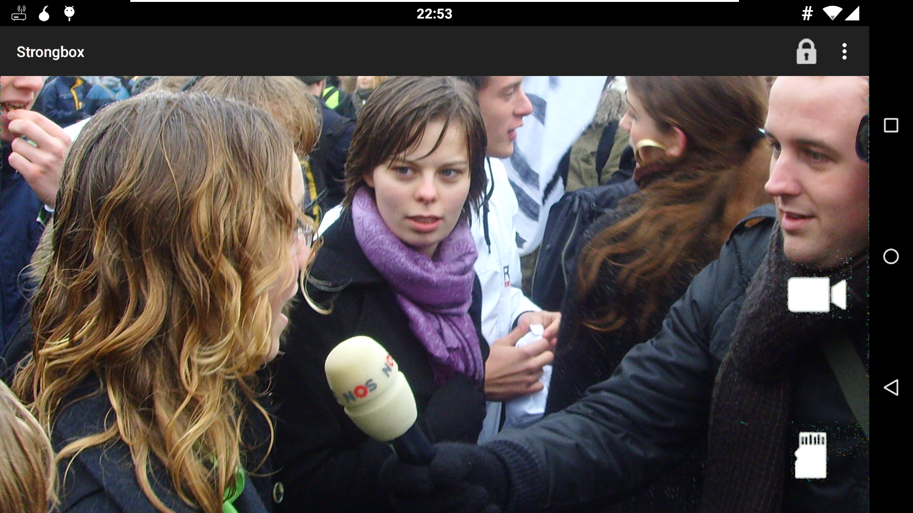

Strongbox
=========
**BETA** Encrypted Video Recording for Android. 

★ On-the-fly encryption: Footage is encrypted as it is taken. Only encrypted data is written to disk, leaving no traces of recorded videos.

★ Industry standard security: Strongbox uses industry standard AES-256 encryption in GCM mode to provide both confidentiality and integrity.

★ Practical security: Lock feature allows you to instantly close down app to prevent access to recorded videos

★ Export safety: Strongbox allows streaming videos directly to your computer to avoid storing unencrypted footage on your memory cards.

Threat Model
------------
For a detailed explanation of what Strongbox can and cannot do, see [threat model](threat.md).

TODO
----
0. Share to computer over HTTPS
0. Request product testing from [the ISC project](https://iscproject.org/request-product-testing/)

Thanks
------
* Guardian Project for IOCipher
* JCodec Team
* FoxDog Studios
